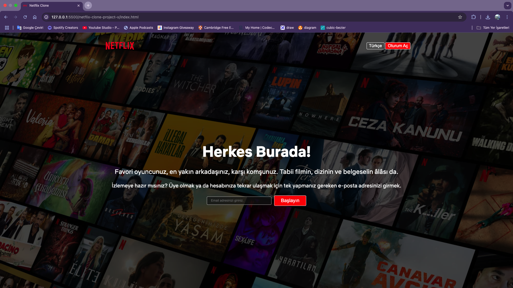
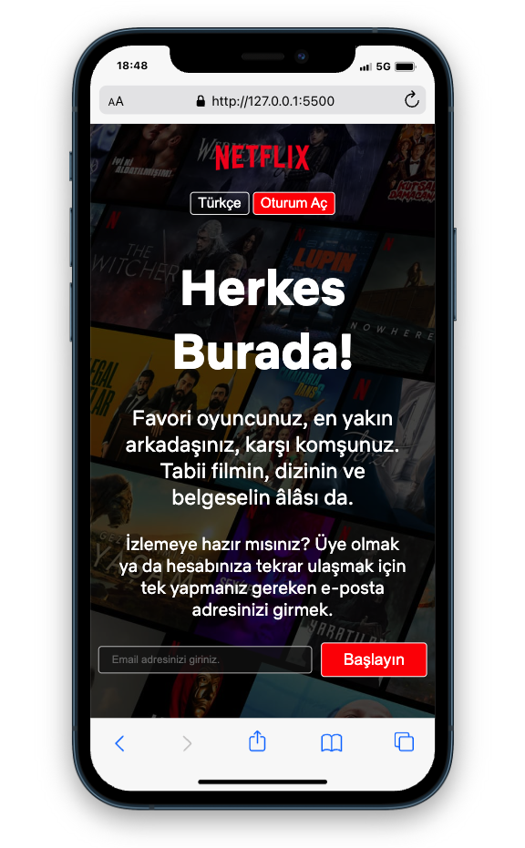

# Netflix Clone

Bu proje, Netflix'in temel arayüzünü taklit eden bir Netflix Clone projesidir. HTML ve CSS kullanılarak oluşturulmuş olup responsive tasarıma sahiptir.

 ## ✨ Özellikler

Responsive Tasarım: Tüm cihazlarda uyumlu görünüyor.

Modern UI: Netflix'in orijinal tasarımına benzer bir kullanıcı arayüzü.

CSS Grid ve Flexbox: Düzenleme için kullanılmıştır.

## 📚 Kullanılan Teknolojiler

* HTML5

* CSS3

## ✨ Kurulum

Projeyi çalıştırmak için aşağıdaki adımları takip edebilirsiniz:

Bu repoyu klonlayın:

git clone https://github.com/kullanici-adin/netflix-clone.git

Proje klasörüne gidin:

cd netflix-clone

index.html dosyasını tarayıcınızda açın.

## 🚀 Ekran Görüntüleri

## 👤 Katkıda Bulunma

Eğer projeye katkıda bulunmak isterseniz pull request açabilirsiniz.

## 🌐 Canlı Önizleme

[project preview](./project-views/netflix-clone.gif)

_Bu proje, yalnızca eğitim amaçlı geliştirilmiştir ve ticari bir amacı yoktur._

